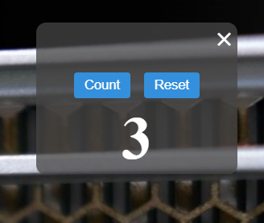
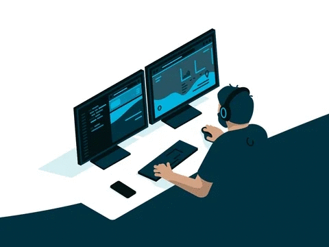

# Desktop Counter Widget

Welcome to my first foray into desktop development! As someone with a background in web development and a deep affection for JavaScript, I embarked on a journey to create a simple and fun counter widget for my everyday tasks.

## Background

As a web developer, I spend a significant amount of time working on various projects using several web frameworks. Recently, I got a new job and wanted a tool that could help me track my progress and keep me motivated. Unfortunately, I couldn't find a counter widget on Microsoft Store that suited my preferences. So that's when the idea struck: why not build my own?

## Introducing the Counter Widget

This counter widget is the result of my exploration into desktop development. It's a lightweight, draggable, and resizable widget that sits on your screen, helping you keep track of your progress in style. Whether you're coding, designing, or simply working on personal tasks, this widget will be your trusty sidekick.

### Features

- Simple and intuitive design
- Click and drag to move the widget around your screen
- Count button to increment the number
- Reset button to start over
- Always-on-top functionality to ensure visibility
- Minimum resizable dimensions for a perfect fit

## Getting Started

1. Make sure you have Node.js installed on your system.
2. Clone this repository to your local machine.
3. Open a terminal in the project directory and run `npm install` to install the required dependencies.
4. Run the widget by executing `npm start`.

## Future Improvements

This is just the beginning of my desktop development journey. I have plans to enhance this widget with more features, customizability, and an even sleeker design. Feel free to contribute, offer suggestions, or use this widget as a starting point for your own creations!

## Acknowledgments

I'd like to thank the open-source community for providing resources and tools that enabled me to create this widget. Your contributions and dedication have inspired me to explore new horizons.

Happy counting!

